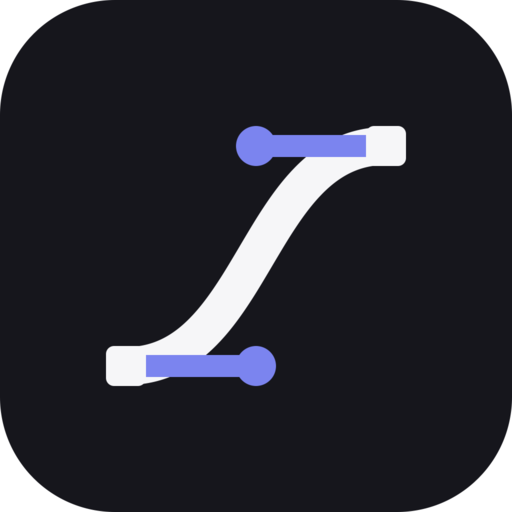

<p align="center">
  
</p>

<h1 align="center">Bezier</h1>

<p align="center"><strong>ハンドルを握る。曲線はエージェントが描く。</strong></p>

<p align="center">プロダクトデザイナー &amp; PdM のためのエージェント・ワークベンチ。<br/>
（Bezier — ベジェ、と読む）</p>

---

Bezier は、プロダクトデザイナー &amp; PdM が AI エージェントに本物のソフトウェアを作らせる場所です。
あなたは少数の**制御点**（やりたいこと・画面への注釈・taste）を置く。エージェントが**実装**を描く。
コマンドは打たず、レビューできる差分が手元に届きます。

ベジェ曲線が少数の制御点とハンドルで全体を決めるように — あなたは要点だけを握り、滑らかな結果が描かれます。

## できること

- **チャットから始まる** — やりたいことを書くと、エージェントが Spec を起草し、隔離された worktree で実装まで進める
- **画面に直接、注釈** — プレビューにピン・ペン・矩形で指示。その注釈がそのまま修正依頼になる
- **Spec と Design を一望** — 対話の横で Spec とプレビューがライブに変化、差分も視覚的に確認
- **安全なマージ** — 各 Issue は隔離された worktree/branch。Commit → Open PR で main を汚さない
- **決定が残る** — なぜそう決めたかがコードと同じ commit に。既存コンポーネントに沿って描き、辿れる
- **黒い画面に怯えない** — エージェントの作業は作業面に溶けて見える。隠さないが、脅さない

## 構成

| パス | 中身 |
|---|---|
| `app/` | デスクトップアプリ（Tauri v2 + Next.js / React 19 / Tailwind v4） |
| `site/` | ランディング（ウェイトリスト）+ Docs |
| `design/brand/` | ブランド戦略 / デザイン原則 / トークン / ロゴ（SSOT） |
| `playbook/` | 戦略・意思決定ログ・運用 |
| `product/` | Issue / Spec / 原則 |

## 開発

```bash
# アプリ（デスクトップ）
cd app && npm install && npm run tauri dev

# サイト（LP / Docs）
cd site && npm install && npm run dev
```

## ブランド

- デザイン原則: [`design/brand/PRINCIPLES.md`](design/brand/PRINCIPLES.md)
- ブランド戦略: [`design/brand/2026-06-12_brand-strategy.md`](design/brand/2026-06-12_brand-strategy.md)
- デザイントークン: [`design/brand/2026-06-12_design-tokens.md`](design/brand/2026-06-12_design-tokens.md)
- ロゴ: [`design/brand/logo/`](design/brand/logo/)
